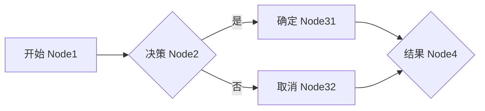

# 异步增强

基于 [`Guava`](https://github.com/google/guava) 、[`transmittable-thread-local`](https://github.com/alibaba/transmittable-thread-local) 扩展

- 使用 `ListenableFuture` 监听任务，任务完成时可以得到计算结果
- 线程池等复用线程的场景下无法正确传递线程本地变量的问题

## 示例

::: code-group

```java [MyRunnable.java]
public static class MyRunnable implements Runnable {

    public String result;

    public MyRunnable(String result) {
        this.result = result;
    }

    @Override
    public void run() {
        // 耗时运算
        ThreadUtil.safeSleep(2000);
    }
}
```

```java [MyFutureCallback.java]
public static class MyFutureCallback implements FutureCallback<Result> {

    @Override
    public void onSuccess(@Nullable Result result) {
        log.info(result.getMsg());
    }

    @Override
    public void onFailure(Throwable t) {
        log.info(t.getMessage());
    }
}
```

```java [MyFutureCallable.java]
@AllArgsConstructor
public static class MyFutureCallable extends AsyncFutureCallback<Result> {

    public String keyword;

    @Override
    public Result call() throws Exception {
        log.info(keyword);
        // 耗时运算
        ThreadUtil.safeSleep(2000);
        return R.succ(keyword);
    }

    @Override
    public void onSuccess(@Nullable Result result) {
        log.info(result.msg());
    }

    @Override
    public void onFailure(@Nullable Throwable t) {
        log.info(t.getMessage());
    }
}
```

:::

### 基础

```java
@Test
@Order(1)
public void executor() {
    // 执行任务,不监听
    Async.submit(new MyRunnable("1"));
    // 执行任务,监听结果
    Async.submit(new MyFutureCallable("2"));
    Async.submit(new MyFutureCallable("3"), new MyFutureCallback());
    Async.submit(() -> R.succ("4"), new MyFutureCallback());
}
```

```log
2025-10-14 15:18:41 INFO fastboot:3944 AsyncTest.java:39 - 1
2025-10-14 15:18:41 INFO fastboot:3944 AsyncTest.java:65 - 2
2025-10-14 15:18:41 INFO fastboot:3945 AsyncTest.java:65 - 3
2025-10-14 15:18:41 INFO fastboot:3946 AsyncTest.java:49 - 4
```

### 转换

```java
@Test
@Order(2)
public void transform() {
    // 初始任务
    ListenableFuture<Result> future1 = Async.submit(() -> R.succ(4));

    // 处理任务
    ListenableFuture<Integer> future2 =
            Futures.transform(
                    future1,
                    input -> {
                        return input.isSuccess() ? Convert.toInt(input.data(), 0) + 1 : 0;
                    },
                    MoreExecutors.directExecutor());

    // 监听结果
    Futures.addCallback(
            future2,
            new FutureCallback<Integer>() {

                @Override
                public void onSuccess(@Nullable Integer result) {
                    log.info(result);
                }

                @Override
                public void onFailure(@Nullable Throwable t) {
                    log.info(t.getMessage());
                }
            },
            Async.getExecutorService());
}
```

```log
2025-10-14 15:47:15 INFO fastboot:3854 AsyncTest.java:113 - 5
```

### 执行器

简易版执行器 `1->2->[31,32]->4`



::: code-group

```java [ActuatorTest.java]
@Test
@Order(1)
public void executor() {

    // 数据 
    String json =
        "[{\"name\":\"node1\",\"type\":\"HTTP\",\"method\":\"GET\",\"url\":\"http://rest.apizza.net/mock/46b8b8197618d143b5a76eeae002abbd/test\",\"params\":{},\"timeout\":5000,\"ret\":\"node1\",\"rule\":\"\",\"ignoreFailure\":false},{\"name\":\"node2\",\"type\":\"HTTP\",\"method\":\"GET\",\"url\":\"http://rest.apizza.net/mock/46b8b8197618d143b5a76eeae002abbd/test\",\"params\":{\"a\":\"$.node1.x\",\"b\":\"$.node1.y\"},\"timeout\":5000,\"ret\":\"node2\",\"rule\":\"\",\"ignoreFailure\":false},[{\"name\":\"node3-1\",\"type\":\"HTTP\",\"method\":\"GET\",\"url\":\"http://rest.apizza.net/mock/46b8b8197618d143b5a76eeae002abbd/test\",\"params\":{\"p1\":311,\"p2\":312},\"timeout\":5000,\"ret\":\"node31\",\"rule\":\"compare($.env.a,2)\",\"ignoreFailure\":false},{\"name\":\"node3-2\",\"type\":\"HTTP\",\"method\":\"GET\",\"url\":\"http://rest.apizza.net/mock/46b8b8197618d143b5a76eeae002abbd/test\",\"params\":{\"p1\":321,\"p2\":322},\"timeout\":5000,\"ret\":\"node32\",\"rule\":\"compare(sum($.env.b,1),2)\",\"ignoreFailure\":false}]]";

    // 上下文
    ActuatorContext context =
        ActuatorContext.builder()
            .trace(IdUtil.fastSimpleUUID())
            .title("测试")
            .env(
                Envar.builder()
                    .custom(Dict.create().set("a", 1).set("b", 2))
                    .saveDir("D:")
                    .debug(true)
                    .build())
            .build();

    // 执行器
    ActuatorDispatch dispatch =
        new ActuatorDispatch(
            context,
            gtl.parseObject(json),
            new ActuatorFutureCallback() {

              @Override
              public void onSuccess(ActuatorContext ctx, Dict result) {
                Console.log(ctx);
                Console.log(result);
              }

              @Override
              public void onFailure(ActuatorContext ctx, Throwable t) {
                Console.log(ctx);
              }
            });
    dispatch.execute();
  }
}
```

```json [input.json]
[
    {
        "name": "node1",
        "type": "HTTP",
        "method": "GET",
        "url": "http://rest.apizza.net/mock/46b8b8197618d143b5a76eeae002abbd/test",
        "params": {},
        "timeout": 5000,
        "ret": "node1",
        "rule": "",
        "ignoreFailure": false
    },
    {
        "name": "node2",
        "type": "HTTP",
        "method": "GET",
        "url": "http://rest.apizza.net/mock/46b8b8197618d143b5a76eeae002abbd/test",
        "params": {
            "a": "$.node1.x",
            "b": "$.node1.y"
        },
        "timeout": 5000,
        "ret": "node2",
        "rule": "",
        "ignoreFailure": false
    },
    [
        {
            "name": "node3-1",
            "type": "HTTP",
            "method": "GET",
            "url": "http://rest.apizza.net/mock/46b8b8197618d143b5a76eeae002abbd/test",
            "params": {
                "p1": 311,
                "p2": 312
            },
            "timeout": 5000,
            "ret": "node31",
            "rule": "compare($.env.a,2)",
            "ignoreFailure": false
        },
        {
            "name": "node3-2",
            "type": "HTTP",
            "method": "GET",
            "url": "http://rest.apizza.net/mock/46b8b8197618d143b5a76eeae002abbd/test",
            "params": {
                "p1": 321,
                "p2": 322
            },
            "timeout": 5000,
            "ret": "node32",
            "rule": "compare(sum($.env.b,1),2)",
            "ignoreFailure": false
        }
    ],
    {
        "name": "node4",
        "type": "HTTP",
        "method": "GET",
        "url": "http://rest.apizza.net/mock/46b8b8197618d143b5a76eeae002abbd/test",
        "params": {
            "c": "$.node32.x",
            "d": "$.node32.y"
        },
        "timeout": 5000,
        "ret": "node4",
        "rule": "",
        "ignoreFailure": false
    }
]
```

```json [output.json]
{
    "trace": "e0ae580c3d404d169c34d667f22ee4a4",
    "title": "测试",
    "env": {
        "custom": {
            "a": 1,
            "b": 2
        },
        "saveDir": "D:",
        "debug": true
    },
    "context": {
        "env": {
            "saveDir": "D:",
            "debug": true,
            "a": 1,
            "b": 2
        },
        "system": {
            "os": "Windows 11",
            "user": "xiesx",
            "host": "DELL-WORK",
            "java": "21.0.8",
            "runtime": 83886080,
            "datatime": "2025-10-22 17:09:18"
        },
        "node1": {
            "x": 1,
            "y": 2
        },
        "node2": {
            "x": 1,
            "y": 2
        },
        "node31": "ignore",
        "node32": {
            "x": 1,
            "y": 2
        },
        "node4": {
            "x": 1,
            "y": 2
        }
    },
    "result": {
        "node4": {
            "x": 1,
            "y": 2
        }
    },
    "error": ""
}
```

